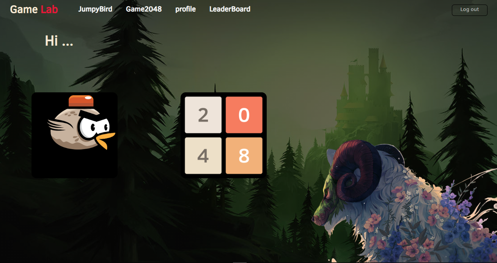
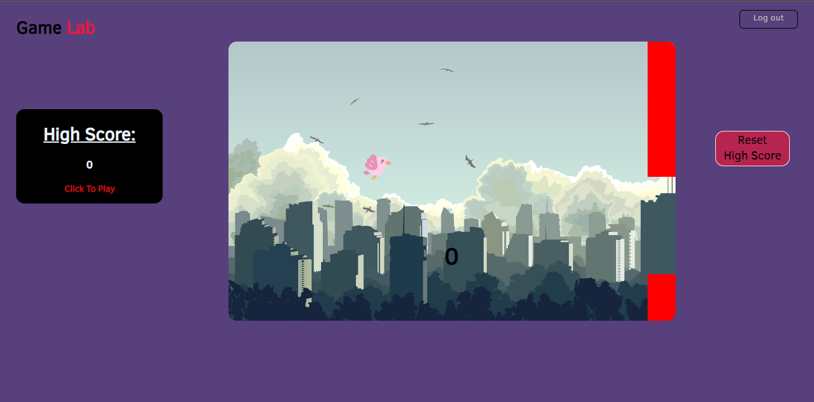
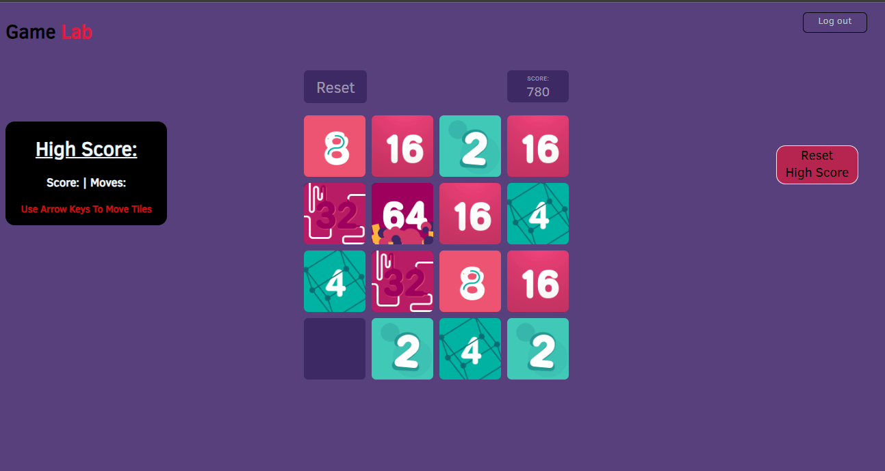
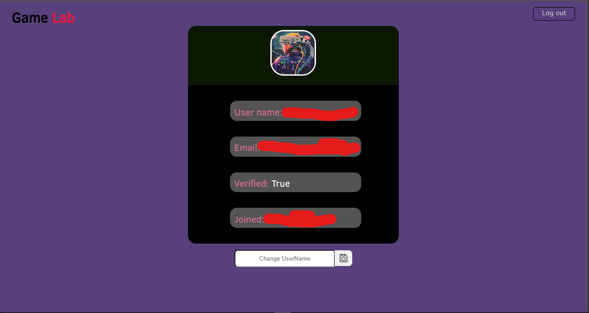

# [GameLab-F](https://game-lab-red.vercel.app/)

An interactive web game app that provides engaging games to help you relax

# Table of Contents

1. [Getting started](#started)
2. [Explanation](#explanation)
3. [Homepage](#home)
4. [Jumpy Bird](#JumpyBird)
5. [2048](#2048)
6. [Profile](#profile)

## <a id="started">Getting started</a>

Website : [GameLab](https://game-lab-red.vercel.app/)

Backend: [repository](https://github.com/edd-ie/GameLab-B)

**Clone** the project files to your local repository:

- HTTPS => `https://github.com/edd-ie/GameLab-F.git`
- SSH => `git@github.com:edd-ie/GameLab-F.git`
- Git CLI => `gh repo clone edd-ie/GameLab-F`

Open terminal.

1. Install Dependencies
2. Run the development website

```
$ npm install
$ npm run dev
```

**Clone** the backend files and run on your local repository:
[Backend repository](https://github.com/edd-ie/GameLab-B)

## <a id="explanation">Explanation</a>

- An user can play a variety of games that are relatively easy to comprehend a has many Homepage
- A 2048 has many Homepage
- Homepage belongs to both Jumpy Bird and 2048.

## <a id="home">Homepage</a>

After the straightforward login the user is greeted by a simple UI that is easy to navigate, Just by a push of a button


## <a id="JumpyBird">Jumpy Bird</a>

Taking inspiration from the well acknowledged flappy bird, JumpyBird is a clicker game were the user tries to keep the bird flying while avoiding to crush on tho oncoming obstacles.

The game speeds up with each score of 10.



## <a id="2048">2048</a>

2048 is a simple slider game where the user tries to match similar numbers with

The aim is to eventually form 2️⃣0️⃣4️⃣8️⃣

The less moves you uses to reach the number the higher your rankings.



## <a id="profile">Profile</a>

The page displays the user's profile information
while also giving the option to update the user's name


